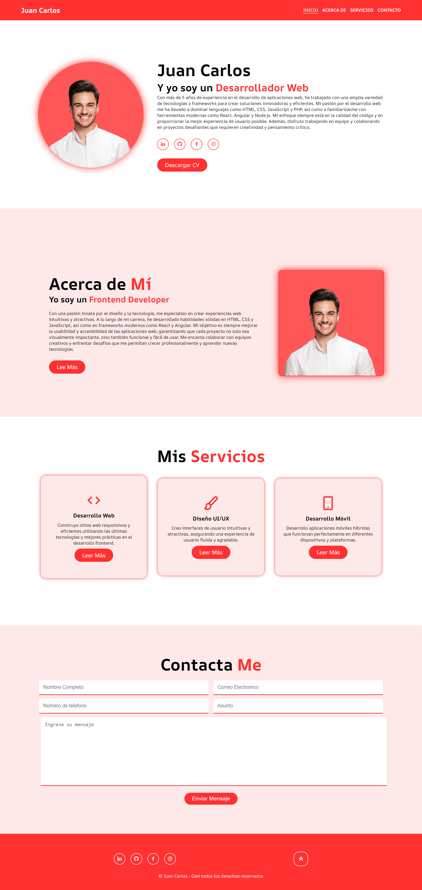

# Proyecto de portafolio

1. [Introducción](#introducción)
2. [Preparación de Recursos](#preparación-de-recursos)
3. [Estructura del Proyecto](#estructura-del-proyecto)
4. [Sección de Incio](#sección-de-incio)
5. [Seccion de Acerca de](#seccion-de-acerca-de)
6. [Seccion de Servicios](#seccion-de-servicios)
7. [Sección de contacto](#sección-de-contacto)
8. [Pie de página](#pie-de-página)
9. [Resumen y recomendaciones](#resumen-y-recomendaciones)

---
## Introducción
Para muchos profesionales creativos, construir un portafolio es más que simplemente compilar trabajos; es un proceso meticuloso de autodescubrimiento y presentación estratégica. Al crear un proyecto de portafolio, se despliega una narrativa visual y conceptual que no solo exhibe habilidades técnicas, sino que también revela la evolución y el estilo personal del creador. Como se ilustra en la siguiente imagen, cada elemento cuidadosamente seleccionado y dispuesto dentro del portafolio tiene el poder de contar una historia única y persuasiva sobre la habilidad y la visión de su autor.



---
## Preparación de Recursos
Cuando se trata de diseñar y desarrollar tu página de portafolio, la elección adecuada de imágenes, fuentes e iconos puede marcar una gran diferencia en la presentación y la impresión que causas en los visitantes. Aquí te guiamos paso a paso para preparar estos recursos clave:

**Imágenes para tu Página de Portafolio**

Las imágenes son fundamentales para captar la atención y transmitir tu estilo y habilidades. Aquí tienes algunas consideraciones:

- **Selección de Imágenes:** Elige imágenes de alta calidad que representen tus mejores trabajos. Asegúrate de tener una variedad que muestre tu versatilidad y experiencia.
  
- **Optimización de Imágenes:** Antes de subirlas a tu página, asegúrate de optimizarlas para la web para mejorar el tiempo de carga y la experiencia del usuario.

- **Ejemplo de Uso:** Puedes incluir capturas de pantalla de proyectos destacados, fotografías de obras físicas si eres artista, o cualquier otro tipo de material visual relevante que muestre tu talento.

**Fuentes para una Tipografía Atractiva**

La elección de fuentes adecuadas puede realzar la estética y legibilidad de tu portafolio:

- **Fuente Google Fonts:** Visita [Google Fonts](https://fonts.google.com/) para explorar una amplia variedad de fuentes gratuitas. Elige una o dos fuentes que complementen tu estilo y la personalidad de tu trabajo.

- **Implementación:** Una vez seleccionadas las fuentes, sigue las instrucciones de Google Fonts para integrarlas en tu página web mediante CSS. Esto asegura que las fuentes se carguen correctamente y se vean consistentes en todos los dispositivos.

**Iconos para Mejorar la Navegación y Usabilidad**

Los iconos son herramientas visuales poderosas que pueden mejorar la navegación y la comprensión de tu portafolio:

- **BoxIcons:** Visita [BoxIcons](https://boxicons.com/) para explorar una extensa biblioteca de iconos gratuitos. Desde íconos de redes sociales hasta elementos de navegación, encontrarás opciones adecuadas para enriquecer tu diseño.

- **Integración:** Descarga los iconos que necesitas en formato SVG o utiliza el CDN proporcionado por BoxIcons para integrarlos en tu proyecto web. Asegúrate de que los iconos sean coherentes en tamaño y estilo para mantener la cohesión visual.

**Estructura de Archivos**

1. **Crear Carpetas:**
   - Crea una carpeta principal para tu proyecto de portafolio. Puedes nombrarla como desees, por ejemplo, `mi-portafolio`.
   - Dentro de esta carpeta, crea subcarpetas para organizar los archivos. Por ejemplo:
     - `css`: Para los archivos CSS.
     - `img`: Para las imágenes que utilizarás en tu portafolio.
     - `js` (opcional): Para archivos JavaScript si los necesitas en el futuro.

2. **Archivos Necesarios:**
   - **index.html**: Este será tu archivo principal HTML que contendrá la estructura básica de tu página.
   - **style.css**: Este archivo contendrá todos los estilos CSS para tu portafolio.
   - **Imágenes**: Guarda todas las imágenes que utilizarás en la carpeta `img`.

**Estructura del Proyecto**

A continuación, te proporciono una estructura básica para tu proyecto de portafolio:

```plaintext
mi-portafolio/
│
├── css/
│   └── style.css
│
├── img/
│   └── imagen1.jpg
│   └── imagen2.png
│   └── ...
│
├── index.html
```

*HTML (`index.html`)*

```html
<!DOCTYPE html>
<html lang="es">

<head>
   <meta charset="UTF-8">
   <meta name="viewport" content="width=device-width, initial-scale=1.0">
   <title>Juan Carlos - Portafolio</title>

   <link href='https://unpkg.com/boxicons@2.1.4/css/boxicons.min.css' rel='stylesheet'>
   <link rel="stylesheet" href="css/style.css">
</head>

<body>
   
</body>

</html>
```

*CSS (`style.css`)*

```css
/* "AR One Sans", sans-serif; */
@import url('https://fonts.googleapis.com/css2?family=AR+One+Sans:wght@400..700&display=swap');

```


---
## Estructura del Proyecto
Para estructurar adecuadamente tu proyecto de portafolio, es importante organizar los archivos y asegurarte de que el código HTML y CSS esté correctamente estructurado. Aquí te proporciono una guía paso a paso:

**Ejemplo de HTML y CSS**

A partir del código HTML y CSS que proporcionaste, asegúrate de seguir las mejores prácticas para mantener tu código organizado y fácil de mantener.

*HTML (`index.html`)*

```html
   <header class="header">
      <a href="#home" class="logo">Juan Carlos</a>
      <i class='bx bx-menu' id="menu-icon"></i>
      <nav class="navbar">
         <a href="#home" class="active">Inicio</a>
         <a href="#about">Acerca de</a>
         <a href="#services">Servicios</a>
         <a href="#contact">Contacto</a>
      </nav>
   </header>

   <!-- Aquí puedes agregar más secciones como 'about', 'services', 'portfolio', etc. -->

   <footer class="footer">
      <!-- Contenido del footer -->
   </footer>
```

**CSS (`style.css`)**

```css
/* Estilos generales */

* {
   margin: 0;
   padding: 0;
   box-sizing: border-box;
   text-decoration: none;
   border: none;
}

:root {
   --bg-color: #ffffff;
   --second-bg-color: #fee9e9;
   --text-color: #000000;
   --main-color: #ff3131;
   --hove-color: #D7DBDD;
}

html {
   font-size: 62.5%;
   overflow-x: hidden;
}

body {
   background-color: var(--bg-color);
   color: var(--text-color);
   font-size: 1.6rem;
   font-family: "AR One Sans", sans-serif;
}

section {
   min-height: 100vh;
   padding: 10rem 9% 2rem;
}

/* Estilos específicos para el header */

.header {
   position: fixed;
   width: 100%;
   top: 0;
   right: 0;
   z-index: 100;
   display: flex;
   justify-content: space-between;
   align-items: center;
   padding: 2rem 5%;
   background-color: var(--main-color);
   transition: all .5s ease;
}

.logo {
   font-size: 2.5rem;
   color: var(--bg-color);
   font-weight: 700;
   transition: 0.3s ease;
}

.logo:hover {
   transform: scale(1.05);
}

.navbar {
   display: flex;
   gap: 1.5rem;
}

.navbar a {
   color: var(--bg-color);
   font-weight: 600;
   transition: .3s ease;
   border-bottom: 2px solid transparent;
   text-transform: uppercase;
}

.navbar a:hover,
a.active {
   border-bottom: 2px solid var(--hove-color);
   color: var(--hove-color);
}

#menu-icon {
   font-size: 3.6rem;
   color: var(--bg-color);
   cursor: pointer;
   display: none;
}
```

*Conclusiones*

Al seguir esta estructura y organización de archivos, facilitarás el mantenimiento y la expansión de tu proyecto de portafolio. Asegúrate de optimizar las imágenes para web y de utilizar fuentes e iconos que complementen tu estilo y mejoren la experiencia del usuario. ¡Buena suerte con tu portafolio!

----
## Sección de Incio 
El código HTML y CSS que proporcionaste para la sección de inicio de tu página de portafolio parece estar bien estructurado y estilizado. Aquí hay algunos puntos para asegurarte de que todo funcione correctamente y se vea como esperas:

*HTML (`index.html`)*

```html
<!-- Sección de inicio -->
<section class="home" id="home">
   <div class="home-img">
      
   </div>

   <div class="home-content">
      <h1>Juan Carlos</h1>
      <h3>Y yo soy un <span>Desarrollador Web</span></h3>
      <p>Con más de 5 años de experiencia en el desarrollo de aplicaciones web, he trabajado con una amplia variedad
         de tecnologías y frameworks para crear soluciones innovadoras y eficientes. Mi pasión por el desarrollo web
         me ha llevado a dominar lenguajes como HTML, CSS, JavaScript y PHP, así como a familiarizarme con
         herramientas modernas como React, Angular y Node.js. Mi enfoque siempre está en la calidad del código y en
         proporcionar la mejor experiencia de usuario posible. Además, disfruto trabajando en equipo y colaborando en
         proyectos desafiantes que requieren creatividad y pensamiento crítico.</p>
      <div class="social-media">
         <a href="#"><i class='bx bxl-linkedin'></i></a>
         <a href="#"><i class='bx bxl-github'></i></a>
         <a href="#"><i class='bx bxl-facebook'></i></a>
         <a href="#"><i class='bx bxl-instagram'></i></a>
      </div>
      <a href="#" class="btn">Descargar CV</a>
   </div>
</section>
```

**Notas:**
- Asegúrate de que la ruta de la imagen (`src="img/photo-profile.png"`) sea correcta y que la imagen esté ubicada en la carpeta `img` dentro de tu proyecto.
- Los enlaces (`href="#"`) en los íconos de redes sociales y el botón de descarga de CV deben rellenarse con las URLs adecuadas cuando estén listas.

*CSS (`style.css`)*

```css
/* Estilos de la sección de inicio */

.home {
   display: flex;
   justify-content: center;
   align-items: center;
   padding: 10rem 0;
   text-align: center;
}

.home-img img {
   width: 25vw; /* Ajusta el tamaño de la imagen según tus necesidades */
   border-radius: 50%;
   box-shadow: 0 0 2.5rem var(--main-color);
   cursor: pointer;
   animation: floatImage 4s ease-in-out infinite;
   transition: .4s ease;
}

.home-img img:hover {
   box-shadow: 0 0 2.5rem var(--main-color),
      0 0 3.5rem var(--main-color),
      0 0 4.5rem var(--main-color);
}

@keyframes floatImage {
   0% {
      transform: translateY(0);
   }

   50% {
      transform: translateY(-2.4rem);
   }

   100% {
      transform: translateY(0);
   }
}

.home-content {
   margin-top: 4rem; /* Ajusta el espacio según sea necesario */
   text-align: center;
}

.home-content h1 {
   font-size: 6rem;
   font-weight: 700;
   line-height: 1.3;
   margin-bottom: 2rem; /* Ajusta el espacio entre elementos según sea necesario */
}

.home-content h3 {
   font-size: 3.7rem;
   font-weight: 700;
}

.home-content h3 span {
   color: var(--main-color);
}

.social-media {
   margin-top: 3rem; /* Ajusta el espacio entre elementos según sea necesario */
}

.social-media a {
   display: inline-flex;
   justify-content: center;
   align-items: center;
   width: 4.2rem;
   height: 4.2rem;
   border: 0.2rem solid var(--main-color);
   border-radius: 50%;
   font-size: 2rem;
   color: var(--main-color);
   margin: 0 1.5rem;
   transition: .3s ease;
}

.social-media a:hover {
   transform: scale(1.2) translateY(-1rem);
   background-color: var(--main-color);
   color: var(--bg-color);
   box-shadow: 0 0 2.5rem var(--main-color);
}

.btn {
   display: inline-block;
   padding: 1rem 2.8rem;
   background: var(--main-color);
   border-radius: 4rem;
   font-size: 2rem;
   color: var(--bg-color);
   font-weight: 400;
   margin-top: 3rem; /* Ajusta el espacio entre elementos según sea necesario */
   transition: .3s ease;
}

.btn:hover {
   box-shadow: 0 0 1.6rem var(--main-color);
   transform: scale(1.1);
}
```

**Notas:**
- Asegúrate de que el selector `.home-img img` se ajuste correctamente al tamaño y estilo que deseas para la imagen de perfil.
- Ajusta los márgenes y espacios (`margin`) según sea necesario para alinear y separar los elementos de manera estética.

Con estas correcciones y ajustes, tu sección de inicio debería lucir y funcionar correctamente según lo planeado. Recuerda adaptar los enlaces y contenido según tu propio perfil y necesidades específicas.

---
## Seccion de Acerca de
Para la sección "Acerca de" de tu página de portafolio, el código HTML y CSS que has proporcionado es sólido. Aquí te proporciono algunas recomendaciones y ajustes para asegurarte de que todo funcione correctamente y se vea bien:

*HTML (`index.html`)*

```html
<!-- Sección de acerca de -->
<section class="about" id="about">
   <div class="about-content">
      <h2 class="heading">Acerca de <span>Mí</span></h2>
      <h3>Yo soy un <span>Frontend Developer</span></h3>
      <p>Con una pasión innata por el diseño y la tecnología, me especializo en crear experiencias web intuitivas y
         atractivas. A lo largo de mi carrera, he desarrollado habilidades sólidas en HTML, CSS y JavaScript, así
         como en frameworks modernos como React y Angular. Mi objetivo es siempre mejorar la usabilidad y
         accesibilidad de las aplicaciones web, garantizando que cada proyecto no solo sea visualmente impactante,
         sino también funcional y fácil de usar. Me encanta colaborar con equipos creativos y enfrentar desafíos que
         me permitan crecer profesionalmente y aprender nuevas tecnologías.</p>
      <a href="#" class="btn">Lee Más</a>
   </div>
   <div class="about-img">
      
   </div>
</section>
```

**Notas:**
- Asegúrate de que la ruta de la imagen (`src="img/photo-profile.png"`) sea correcta y que la imagen esté ubicada en la carpeta `img` dentro de tu proyecto.
- Rellena el enlace (`href="#"`) en el botón "Lee Más" con la URL adecuada cuando tengas contenido adicional para esa sección.

*CSS (`style.css`)*

```css
/* Estilos de la sección "Acerca de" */

.about {
   display: flex;
   justify-content: center;
   align-items: center;
   gap: 2rem;
   padding: 10rem 0; /* Ajusta el padding según necesites para separación */
   background-color: var(--second-bg-color); /* Define el color de fondo secundario */
}

.about-img img {
   width: 25vw; /* Ajusta el tamaño de la imagen según necesites */
   border: .2rem solid var(--main-color);
   border-radius: 1rem;
   box-shadow: 0 0 2.5rem var(--main-color);
   cursor: pointer;
   transition: .4s ease;
}

.about-img img:hover {
   box-shadow: 0 0 2.5rem var(--main-color),
      0 0 3.5rem var(--main-color),
      0 0 4.5rem var(--main-color);
}

.heading {
   font-size: 6rem; /* Ajusta el tamaño del título según necesites */
   font-weight: 700; /* Asegura que el peso de la fuente sea consistente */
   line-height: 1.2;
}

.about-content {
   text-align: left; /* Alinea el contenido a la izquierda */
   max-width: 50rem; /* Define el ancho máximo del contenido según necesites */
   padding: 0 4rem; /* Ajusta el padding según necesites para separación */
}

.about-content h2 {
   margin-bottom: 1rem; /* Ajusta el espacio entre elementos según necesites */
}

.about-content h3 {
   font-size: 3rem; /* Ajusta el tamaño del subtítulo según necesites */
   font-weight: 700; /* Asegura que el peso de la fuente sea consistente */
}

.about-content p {
   margin-bottom: 2rem; /* Ajusta el espacio entre elementos según necesites */
}

.btn {
   display: inline-block;
   padding: 1rem 2.8rem;
   background: var(--main-color);
   border-radius: 4rem;
   font-size: 2rem; /* Ajusta el tamaño del texto del botón según necesites */
   color: var(--bg-color);
   font-weight: 400;
   transition: .3s ease;
   text-decoration: none; /* Asegura que el botón no tenga subrayado */
}

.btn:hover {
   box-shadow: 0 0 1.6rem var(--main-color);
   transform: scale(1.1);
}
```

**Notas:**
- Ajusta los estilos de acuerdo a tus preferencias estéticas y al diseño general de tu portafolio.
- Asegúrate de mantener consistencia en la tipografía, colores y espaciado para una apariencia profesional y coherente.

Con estos ajustes, tu sección "Acerca de" debería estar lista para mostrar tu información de manera clara y atractiva. Recuerda revisar y ajustar los detalles según tu contenido específico y preferencias de diseño.

---
## Seccion de Servicios
Para la sección de servicios de tu página de portafolio, aquí tienes el código HTML y CSS con algunos ajustes para asegurar que todo funcione correctamente y se vea bien:

*HTML (`index.html`)*

```html
<!-- Sección de servicios -->
<section class="services" id="services">
   <h2 class="heading">Mis <span>Servicios</span></h2>
   <div class="services-content">
      <div class="service-item">
         <i class='bx bx-code'></i>
         <h3>Desarrollo Web</h3>
         <p>Construyo sitios web responsivos y eficientes utilizando las últimas tecnologías y mejores prácticas en el desarrollo frontend.</p>
         <a href="#" class="btn">Leer Más</a>
      </div>
      <div class="service-item">
         <i class='bx bx-paint'></i>
         <h3>Diseño UI/UX</h3>
         <p>Creo interfaces de usuario intuitivas y atractivas, asegurando una experiencia de usuario fluida y agradable.</p>
         <a href="#" class="btn">Leer Más</a>
      </div>
      <div class="service-item">
         <i class='bx bx-mobile-alt'></i>
         <h3>Desarrollo Móvil</h3>
         <p>Desarrollo aplicaciones móviles híbridas que funcionan perfectamente en diferentes dispositivos y plataformas.</p>
         <a href="#" class="btn">Leer Más</a>
      </div>
   </div>
</section>
```

**Notas:**
- Asegúrate de rellenar los enlaces (`href="#"`) en los botones "Leer Más" con las URLs adecuadas cuando tengas contenido adicional para cada servicio.

*CSS (`style.css`)*

```css
/* Estilos de la sección de servicios */

.services {
   text-align: center;
   padding: 10rem 0;
   background-color: var(--second-bg-color);
}

.services h2 {
   margin-bottom: 2rem;
}

.services-content {
   display: flex;
   justify-content: center;
   gap: 2rem;
   flex-wrap: wrap;
   max-width: 120rem; /* Ajusta el ancho máximo según necesites */
   margin: auto;
}

.service-item {
   flex: 1 1 30rem;
   background-color: var(--bg-color);
   padding: 6rem 2rem;
   margin: 1rem;
   border-radius: 2rem;
   box-shadow: 0 0 1rem var(--main-color);
   transition: .3s ease;
   text-align: center;
}

.service-item:hover {
   outline: 3px solid var(--main-color);
   cursor: pointer;
   transform: scale(1.05);
}

.service-item i {
   font-size: 6rem;
   color: var(--main-color);
}

.service-item h3 {
   font-size: 2.5rem;
   margin: 1.5rem 0;
}

.service-item p {
   font-size: 1.8rem;
   margin: 1.5rem 0;
}

.btn {
   display: inline-block;
   padding: 1.2rem 3rem;
   background-color: var(--main-color);
   color: var(--bg-color);
   font-size: 1.8rem;
   border-radius: 3rem;
   text-decoration: none;
   transition: background-color 0.3s ease, transform 0.2s ease;
}

.btn:hover {
   background-color: #ff4444; /* Cambia el color de fondo al hacer hover */
   transform: scale(1.05);
}
```

**Notas:**
- Asegúrate de ajustar los estilos según tus preferencias estéticas y el diseño general de tu página.
- Los estilos proporcionados incluyen efectos de hover para resaltar los servicios y hacen uso de transiciones para una experiencia visual agradable.

Con estos ajustes, la sección de servicios de tu página de portafolio debería lucir profesional y funcional. Recuerda personalizar los textos, enlaces y estilos adicionales según tus necesidades específicas.

---
## Sección de contacto
Para la sección de contacto de tu página de portafolio, aquí tienes el código HTML y CSS con algunos ajustes para asegurar que todo funcione correctamente y se vea bien:

*HTML (`index.html`)*

```html
<!-- Sección de Contacto -->
<section class="contact" id="contact">
   <h2 class="heading">Contacta <span>Conmigo</span></h2>

   <form action="">
      <div class="input-box">
         <input type="text" name="name" placeholder="Nombre Completo" required>
         <input type="email" name="email" placeholder="Correo Electrónico" required>
      </div>
      <div class="input-box">
         <input type="tel" name="phone" placeholder="Número de Teléfono" required>
         <input type="text" name="subject" placeholder="Asunto" required>
      </div>
      <textarea name="message" id="message" cols="30" rows="10" placeholder="Ingrese su mensaje" required></textarea>
      <input type="submit" value="Enviar Mensaje" class="btn">
   </form>
</section>
```

**Notas:**
- Se han añadido atributos `required` en los campos de entrada del formulario para asegurar que no se envíen campos vacíos.
- Asegúrate de rellenar el atributo `action` del formulario con la URL adecuada para procesar el envío del formulario.

*CSS (`style.css`)*

```css
/* Estilos de la sección de contacto */

.contact {
   background-color: var(--second-bg-color);
   text-align: center;
   padding: 10rem 0; /* Ajusta el padding según necesites */
}

.contact form {
   max-width: 60rem; /* Ajusta el ancho máximo del formulario según necesites */
   margin: 0 auto;
   padding: 2rem;
   border-radius: 1rem;
   box-shadow: 0 0 1rem rgba(0, 0, 0, 0.1);
}

.input-box {
   display: flex;
   justify-content: center;
   flex-wrap: wrap;
   gap: 1rem;
}

.contact form .input-box input {
   width: calc(50% - 1rem); /* Ajusta el ancho de los inputs según necesites */
   margin: 0.7rem 0.5rem;
   padding: 1rem;
   font-size: 1.6rem; /* Ajusta el tamaño de la fuente según necesites */
   color: var(--text-color);
   background: var(--bg-color);
   border: 0.2rem solid var(--main-color);
   border-radius: 0.8rem;
   transition: border-color 0.3s ease;
}

.input-box input:focus {
   outline: none;
   border-color: var(--main-color);
}

.contact form textarea {
   width: calc(100% - 1rem); /* Ajusta el ancho del textarea según necesites */
   margin: 0.7rem 0.5rem;
   padding: 1rem;
   font-size: 1.6rem; /* Ajusta el tamaño de la fuente según necesites */
   color: var(--text-color);
   background: var(--bg-color);
   border: 0.2rem solid var(--main-color);
   border-radius: 0.8rem;
   resize: none;
   transition: border-color 0.3s ease;
}

.contact form textarea:focus {
   outline: none;
   border-color: var(--main-color);
}

.btn {
   display: inline-block;
   padding: 1.5rem 3rem;
   background-color: var(--main-color);
   color: var(--bg-color);
   font-size: 1.8rem; /* Ajusta el tamaño del texto del botón según necesites */
   border-radius: 3rem;
   text-decoration: none;
   transition: background-color 0.3s ease, transform 0.2s ease;
   cursor: pointer;
}

.btn:hover {
   background-color: #ff4444; /* Cambia el color de fondo al hacer hover */
   transform: scale(1.05);
}
```

**Notas:**
- Ajusta los estilos según tus preferencias estéticas y el diseño general de tu página.
- Se han agregado estilos para los estados `focus` de los campos de entrada (`input` y `textarea`) para mejorar la usabilidad del formulario.

Con estos ajustes, la sección de contacto de tu página de portafolio debería estar lista para que los visitantes puedan enviar mensajes de manera efectiva. Recuerda personalizar los textos, enlaces y estilos adicionales según tus necesidades específicas.

---
## Pie de página
Aquí tienes el código HTML y CSS para el pie de página (footer) de tu página de portafolio:

*HTML (`index.html`)*

```html
<!-- Pie de Página -->
<footer class="footer">
   <div class="footer-content">
      <div class="social-media">
         <a href="#"><i class="bx bxl-linkedin"></i></a>
         <a href="#"><i class="bx bxl-github"></i></a>
         <a href="#"><i class="bx bxl-facebook"></i></a>
         <a href="#"><i class="bx bxl-instagram"></i></a>
      </div>
      <div class="arrow">
         <a href="#home"><i class='bx bx-chevrons-up'></i></a>
      </div>
   </div>
   <p class="copyright">
      © Juan Carlos - Todos los derechos reservados
   </p>
</footer>
```

*CSS (`style.css`)*

```css
/* Estilos de pie de página */

.footer {
   background-color: var(--main-color);
   padding: 4rem 0; /* Ajusta el padding según necesites */
   text-align: center;
}

.footer-content {
   display: flex;
   align-items: center;
   justify-content: center;
}

.footer .social-media a {
   color: var(--bg-color);
   border: 0.2rem solid var(--bg-color);
   font-size: 2.5rem; /* Ajusta el tamaño de los íconos según necesites */
   margin: 0 1rem;
   padding: 1rem;
   border-radius: 50%;
   transition: all 0.3s ease;
}

.footer .social-media a:hover {
   background-color: var(--bg-color);
   color: var(--main-color);
   box-shadow: 0 0 1rem rgba(0, 0, 0, 0.2);
}

.footer .arrow a {
   display: inline-flex;
   color: var(--bg-color);
   border: 0.2rem solid var(--bg-color);
   font-size: 3rem; /* Ajusta el tamaño de la flecha según necesites */
   padding: 1rem;
   border-radius: 50%;
   transition: all 0.3s ease;
}

.footer .arrow a:hover {
   background-color: var(--bg-color);
   color: var(--main-color);
   box-shadow: 0 0 1rem rgba(0, 0, 0, 0.2);
   transform: scale(1.1);
}

.footer p {
   color: var(--second-bg-color);
   margin-top: 2rem; /* Ajusta el margen superior según necesites */
}
```

**Notas:**
- Asegúrate de ajustar los estilos según tus preferencias estéticas y el diseño general de tu página.
- Los estilos proporcionados incluyen efectos de hover para los íconos de redes sociales y la flecha de regreso arriba.
- Personaliza los enlaces de las redes sociales (`href="#"`) con las URLs correctas.
- Ajusta los tamaños de fuente, colores y márgenes según sea necesario para que se adapten al diseño general de tu página de portafolio.

Con estos ajustes, el pie de página de tu página de portafolio debería lucir profesional y complementar el diseño general de tu sitio web.

---
## Resumen y recomendaciones
**Resumen**
En este proyecto de portafolio, hemos creado una estructura básica y estilos para varias secciones clave de tu página web. Aquí está un resumen de lo que hemos cubierto:

1. **Introducción y Estructura del Proyecto**:
   - Creamos una estructura básica de archivos HTML, CSS y colocamos las imágenes necesarias en un directorio `images`.
   - Configuramos fuentes desde Google Fonts y íconos desde Boxicons para usar en el proyecto.

2. **Secciones de la Página**:
   - **Inicio**: Mostramos una imagen de perfil con animación, una breve introducción y enlaces a perfiles de redes sociales.
   - **Acerca de**: Describimos tu experiencia y habilidades como desarrollador web, acompañado de otra imagen de perfil.
   - **Servicios**: Enumeramos varios servicios que ofreces como desarrollo web, diseño UI/UX y desarrollo móvil.
   - **Contacto**: Implementamos un formulario de contacto básico con campos para nombre, correo electrónico, teléfono y mensaje.
   - **Pie de Página**: Incluimos enlaces a redes sociales y una flecha de regreso arriba, además del aviso de derechos de autor.

3. **Estilos CSS**:
   - Aplicamos estilos para cada sección, incluyendo colores personalizados, tipografía y efectos de hover para interactividad.
   - Utilizamos flexbox para diseño flexible y responsive, asegurando que el contenido se vea bien en diferentes dispositivos.

**Recomendaciones**

Para mejorar aún más tu proyecto de portafolio, considera las siguientes recomendaciones:

1. **Responsive Design**:
   - Asegúrate de que tu página sea completamente responsive. Prueba en diferentes dispositivos y resoluciones para garantizar una experiencia de usuario consistente.

2. **Detalles de Usabilidad**:
   - Mejora la accesibilidad del formulario de contacto añadiendo etiquetas `<label>` asociadas con cada campo de entrada.
   - Implementa validación adicional en el lado del servidor para el formulario de contacto para prevenir envíos de spam.

3. **Optimización de Imágenes**:
   - Optimiza las imágenes para web para mejorar el tiempo de carga de la página. Puedes usar herramientas como TinyPNG para comprimir las imágenes sin perder calidad.

4. **SEO (Optimización en Motores de Búsqueda)**:
   - Agrega meta etiquetas `<meta>` apropiadas en el `<head>` de tu documento HTML, como `description`, `keywords`, y `author`, para mejorar la visibilidad en motores de búsqueda.

5. **Actualizaciones Constantes**:
   - Mantén tu portafolio actualizado con nuevos proyectos, habilidades y testimonios a medida que avances en tu carrera como desarrollador web.

Siguiendo estas recomendaciones, tu proyecto de portafolio no solo será visualmente atractivo y funcional, sino también efectivo para presentar tu trabajo y habilidades a potenciales empleadores o clientes.


[Ruta del proyecto](../project/portafolio)